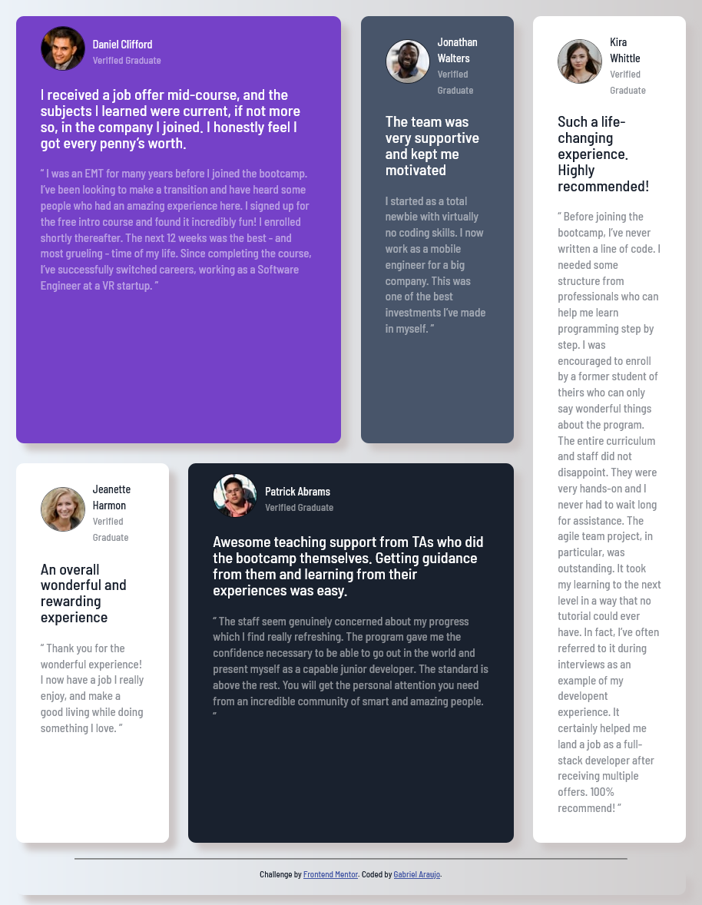

# Frontend Mentor - Testimonials grid section solution

Esta é uma solução para [Testimonials grid section challenge on Frontend Mentor](https://www.frontendmentor.io/challenges/testimonials-grid-section-Nnw6J7Un7).

## Table of contents

- [Overview](#overview)
  - [O Desafio](#o-desafio)
  - [Screenshot](#screenshot)
  - [Links](#links)
- [Meu Processo](#meu-processp)
  - [Construído Com](#construido-com)
  - [O que eu aprendi](#what-i-learned)
- [Autor](#author)

# <<<<<<< HEAD

> > > > > > > 1275d2db9482f15ec519de27d11953f4b5c21e41

## Overview

### O Desafio

Nesse desafio foi utilizado Flex-Grid para distribuir os Testimonials na tela.

### Screenshot



=======

> > > > > > > 1275d2db9482f15ec519de27d11953f4b5c21e41

### Links

- # Solução URL: [Projeto2 URL](https://gabrielmontaraujo.github.io/Projeto2/)
  > > > > > > > 1275d2db9482f15ec519de27d11953f4b5c21e41

## Meu Processo

### Construído Com

- Semantic HTML5 markup
- CSS custom properties
- Flexbox
- CSS Grid
- Mobile-first workflow

### O que eu aprendi

Use this section to recap over some of your major learnings while working through this project. Writing these out and providing code samples of areas you want to highlight is a great way to reinforce your own knowledge.

To see how you can add code snippets, see below:

```html
<h1>Some HTML code I'm proud of</h1>
```

```css
.proud-of-this-css {
  color: papayawhip;
}
```

```js
const proudOfThisFunc = () => {
  console.log('🎉')
}
```

## Autor

- Website - [Gabriel Araujo](https://github.com/GabrielMontAraujo)
